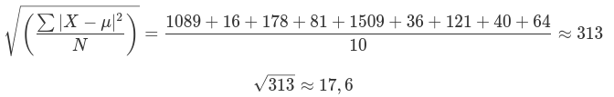
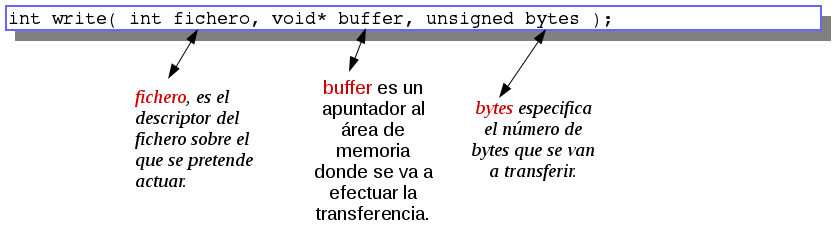

# Practica 1 

---

>**1.** Identifique similitudes y diferencias entre los sockets en C y en Java.

* **Creación y utilización:**
  - En C se utiliza la librería estándar **sys/socket.h** (tiene funciones y manejos primitivos).
  
  - En Java se utiliza **java.net** para la creación de los sockets y otros módulos provenientes de la librería **java.io** para la comunicación de los mismos a modo de *read & write*, le da un uso a los sockets en un paradigma de alto nivel.
  
* **Implemetacion:**
  - En enfoque a Java, cuenta con una clase **java.net.Socket** ,la cual permite una comunicación bidireccional entre dos procesos en una red (la cual son definidos por el programa). También cuenta con la clase **java.net.ServerSocket** para la implementación de sockets que estén *listen* y aceptando conexiones de procesos clientes.
  - En cambio C, no existe una distinción marcada entre el Cliente/Servidor. Si no que el modelo puede ser implementado pero la librería que se utiliza no cuenta con funciones directamente relacionadas con esta tarea. La librería **sys/socket.h** contiene la función socket, que se carga de crear un socket.  En C, son representados por file descriptors, de los cuales se conoce un numero único (de identificación), los cuales se utilizan de la misma manera que archivos en un file system (*leyéndolos y escribiéndolos*). Ademas se utilizan operaciones tales como: *bind*, *listen* y *accept* sobre el socket servidor para darle una dirección, permitirle escuchar conexiones o aceptarlas respectivamente.
* **Similitudes:**
  - Tanto Java como C tienen el mismo fin, poseen características y funciones suficientes para cumplir el modelo de Cliente / Servidor, poder lograr una comunicación a través de los sockets, pueden intercambiar cualquier flujo de datos ya seas procesos en la misma PC o distinta(se permite elegir el protocolo (TCP/UDP). 
  La lectura funciona de la misma manera. Apenas llega algún dato al receptor, se libera (el buffer/stream) para continuar con la ejecución.

>**2.** Tanto en C como en Java (directorios csock-javasock):

>- **a.-** ¿Por qué puede decirse que los ejemplos no son representativos del modelo c/s?. 

  - Las conexión no implica específicamente una petición, o una respuesta a una petición, **solo es comunicación**. En este caso, el servidor cierra la conexión al primer request y envió de respuesta. No se respetan los pasos a cumplir de una conexión: inicialización ,envió/recepción de peticiones finalización.
    Solo se realiza la transferencias de datos sin mensajes de envió/cierre de conexión. 

>- **b.-** Muestre que no necesariamente siempre se leen/escriben todos los datos involucrados en las comunicaciones con una llamada read/write con sockets.
*Sugerencia: puede modificar los programas (C o Java o ambos) para que la cantidad de datos que se comunican sea de 103,  104,  105 y  106 bytes  y  contengan  bytes  asignados  directamente  en  el  programa (pueden  no  leer  de  teclado  ni  mostrar  en  pantalla  cada  uno  de  los  datos  del  buffer), explicando  el  resultado  en  cada  caso. Importante: notar  el  uso de  “attempts”  en “...attempts to read up to count bytes from file descriptor fd...” así como el valor de retorno de la función read (del man read).*

  - Modificamos el código del cliente y servidor (del lenguaje C), en donde el buffer puede ser definido en tiempo de compilación (con las directivas #ifdef, #else y #endif). 
    
  - El tamaño del buffer tanto del cliente como del servidor se fueron ejecutando con los diferentes valores mencionados en el punto, para ver hasta que cantidad de datos se pueden leer.
    El servidor pudo leer correctamente todos los caracteres enviados para un *BUFFER_SIZE* menor o igual a 104.
    **Cuando el tamaño es mayor solo se pueden leer ≈ 65482** *como podemos observar en la siguiente imagen.*
    
    
    
    
> **Nota:** Se encuentran en csocks los archivos **client_2b.c** y **server_2b.c**

>- **c.-** Agregue a la modificación anterior una verificación de llegada correcta de los datos que se envían(cantidad y contenido del buffer), de forma tal que se asegure que todos los datos enviados llegan correctamente, independientemente de la cantidad  de datos involucrados.

Agregamos una función de hash en el cliente y servidor, `unsigned long djb2(unsigned char *str); ` la  cual genera un hash de los datos recibidos para después utilizarlo al realizar un checksum.

El *cliente* genera un hash de los datos que se van a enviar, los cuales son mandados al servidor esperando la respuesta de que los datos fueron recibidos, como también el hash y el tamaño (de los datos).
Por otra parte, el *servidor* espera los datos, el hash y el tamaño de los datos enviados por el cliente.  Una vez que tiene todo esto, genera el hash de los datos recibidos y compara el hash y la cantidad de datos recibidos con el hash que se recibió y el tamaño de los datos que enviá el cliente.

.

> **Nota:** Los archivos que realizan el punto C son: **client_2c.c** y **server_2c.c**

>- **d.-** Grafique el promedio y la desviación estándar de los tiempos de comunicaciones de cada comunicación. Explique el experimento realizado para calcular el tiempo de comunicaciones.

Utilizamos la la función **dwalltime** para medir el tiempo existente entre el comienzo de la transmisión de datos y la confirmación del servidor de los mismos fueron recibidos.

<u>*Comunicación 10*</u>3

- Tiempo en segundos: 

  0.000155s - 0.000104s
  0.000095s - 0.000117s
  0.000161s - 0.000102s
  0.000097s - 0.000111s
  0.000116s - 0.000107s

Media : 0.000112s

Quitamos los 0 (ceros) para que el calculo sea mas sencillo y con media μ = ~~0.000~~112s -> 112s.

Calculamos la distancia de cada dato a la media (es decir, las desviaciones) y elevamos cada una de esas distancias al cuadrado.

.

**Promedio -- Media aritmética(μ): 0.000112s**
**Desviación estándar (σ) 0.000018s**

<u>*Comunicación 10*</u>4

- Tiempo en segundos: 
  0.000201s - 0.000132s
  0.000158s - 0.000210s
  0.000208s - 0.000215s
  0.000178s - 0.000140s
  0.000199s - 0.000215s

**Promedio - Media aritmética(μ): 0.000186s
Desviación estándar (σ): 0.000030s**

*<u>Comunicación 10</u>5*

- Tiempo en segundos: 
  0.000337s - 0.000301s
  0.000315s - 0.000291s
  0.000295s - 0.000345s
  0.000335s - 0.000315s
  0.000275s - 0.000331s

**Promedio - Media aritmética(μ): 0.000314s
Desviación estándar (σ): 0.000022s**

<u>*Comunicación 10*</u>6

- Tiempo en segundos: 
  0.002966s - 0.002730s
  0.002611s - 0.002626s
  0.002823s - 0.002778s
  0.002821s - 0.002905s
  0.002941s - 0.002532s

**Promedio - Media aritmética (μ): 0.002774s
Desviación estándar (σ): 0.000141s**

>**Nota**: Los ejercicios están plasmados en **client_2d.c** y **server_2d.c** (aunque no sufrió modificaciones de server_2c.c)

>**3.** ¿Por qué en  C  se  puede  usar  la  misma  variable  tanto  para  leer  de  teclado  como  para enviar por un socket? ¿Esto sería relevante para las aplicaciones c/s?

<u>Función write en C:</u>

En el caso de la variable utilizada para leer de teclado,la misma se define como : `char buffer[256]`;
Por lo tanto, buffer es una variable de tipo puntero,la cual referencia un espacio de memoria de caracteres alocado en forma estática.
Es por esto que, dado que *write espera un argumento de tipo puntero como lo es la variable `buffer`*, puedo utilizar  la  misma  variable  **tanto para  entrada de texto del teclado como para el envio del mismo por un socket**.
Es decir, al momento de manejar memoria y punteros tiene ciertas desventajas al momento de programar una arquitectura del modelo cliente-servidor.  Ya que se deben usar con precauciones dado que, siendo siempre un espacio de bytes, dependerá de como el cliente interprete los datos en el espacio de memoria recibido al momento de acceder a la información.

>**4.** ¿Podría implementar  un  servidor  de  archivos  remotos  utilizando  sockets?  Describa brevemente la interfaz y los detalles que considere más importantes del diseño. No es necesario implementar.

Para plantear una implementación de servidor de archivos remotos utilizando sockets se deben utilizar de una serie de operaciones necesarias para el manejo del filesystem. Como así también la utilización de un protocolo de red para la comunicación y transferencia de información. Para este caso usaremos el protocolo existente FTP(TCP).

- FTP:

Puede realizarse una implementación de FTP utilizando dos sockets de tipo TCP para el servidor. Estos sockets deben escuchar en los puertos estándar 20(datos) y 21(control)

Operaciones necesarias para el manejo del filesystem del servidor:

- cd `directorio`

Se utiliza para cambiar el directorio actual de trabajo del servidor remoto. Recibe como parámetro una ruta relativa o absoluta del filesystem. En el caso de que no se reciba parámetro el cambio se realiza al directorio principal.

Cuando el cliente envia el comando `cd directorio`, el servidor debe cambiar el directorio de trabajo actual.
- cp `direcctorio_origen directorio_destino`

Se utiliza para copiar un archivo o directorio desde origen a destino del servidor remoto. Ambas ubicación pueden ser relativas al directorio actual o absoluta.

El cliente envía el comando `cd origin destino` y el servidor debe realizar la copia del archivo o directorio al destino.

- delete `ubicacion_de_archivo_o_directorio`

Elimina un archivo o directorio del filesystem en el servidor remoto.

El cliente envía el comando `delete` seguido de un nombre de archivo o directorio a eliminar. El servidor comprueba la existencia del archivo o directorio y lo elimina.
- find `nombre_de_archivo`

Realiza la búsqueda de un archivo por el nombre del parámetro en el filesystem del servidor remoto.

El cliente envía el comando `find` seguido del nombre a buscar. El servidor retornara una lista que contiene la ubicación de los archivos que coincida el nombre o bien no retornara nada en caso de que ningún archivo en el filesystem coincida con el nombre.
- get `ubicacion_del_archivo`

Retornará el archivo que se encuentra en la ubicación que se pasó como parámetro.

El cliente envia el el comando `get` seguido de la dirección absoluta o relativa del archivo. Como resultado de la operación el servidor remoto verifica que el archivo exista y transfiere el archivo a la máquina local en el directorio actual.
- ls

Crea una lista con todos los archivos que se encuentran en el directorio actual.

El cliente envía el comando `ls` y el servidor remoto responde con la lista de archivos del directorio actual junto con el tamaño de cada archivo.
- mkdir `nombre_de_carpeta`

Crea un nuevo directorio con nombre `nombre_de_carpeta` en la dirección actual en el filesystem.

El cliente envía el comando `mkdir nombre_de_carpeta`, el servidor debe verificar que no exista un directorio con el mismo nombre es esa ubicación. Si no existe el servidor crea el directorio.
- mv `origen destino`

Mueve un archivo o directorio desde origen a destino del servidor remoto. Ambas direcciones pueden ser relativas al directorio actual o absoluta.
- put `nombre_del_archivo`

Envía el archivo nombre_del_archivo de la máquina local al servidor remoto.

El cliente envía el comando `put nombre_del_archivo`, y el servidor debe recibir el archivo y almacenarlo en el directorio actual de trabajo.

- pwd

Muestra el path absoluto del directorio actual.

El cliente envía el comando `pwd` y el servidor remoto responde con la dirección absoluta del directorio actual de trabajo.

Para los comandos `cp, delete, mkdir, mv, put` el cliente debe tener permisos de escritura en el directorio correspondiente del servidor remoto, para los demas solo basta con tener permisos de lectura.

>**5.** Defina qué es  un  servidor  con  estado  (stateful  server)  y qué es  un  servidor  sin  estado (stateless server).

- <u>Stateful Server</u>  

Un  servidor  con  estado  es  aquel  que  mantiene  el estado de la información del usuario en forma de sesiones. Este tipo de servidores recuerda los datos del cliente (estado) de una solicitud a la siguiente. Servidores con estado, almacenar estado de sesión. 
Por  lo  tanto,  pueden  realizar  un  seguimiento  de que  clientes  han  abierto  que  archivos,  punteros de lectura y escritura actuales para archivos, que archivos han sido bloqueados por que clientes, etc. 

- <u>Stateless Server</u>

A diferencia de un servidor con estado, el servidor sin estado es aquel que no mantiene ningún estado de la información para el usuario.  En este tipo de servidores, cada consulta es completamente independiente a la anterior. Sin embargo, los servidores sin estado pueden identificar al usuario si la solicitud al servicio incluye una identificación de usuario única que se asigno anteriormente al mismo. 
Ese identificador (ID) del usuario deberá pasarse en cada consulta,  a diferencia  del  caso  de  los  servidores  con  estado  que mantienen  este  ID  de  usuario  en  la  sesión  y  los datos de la solicitud no necesariamente deben contener este ID.
