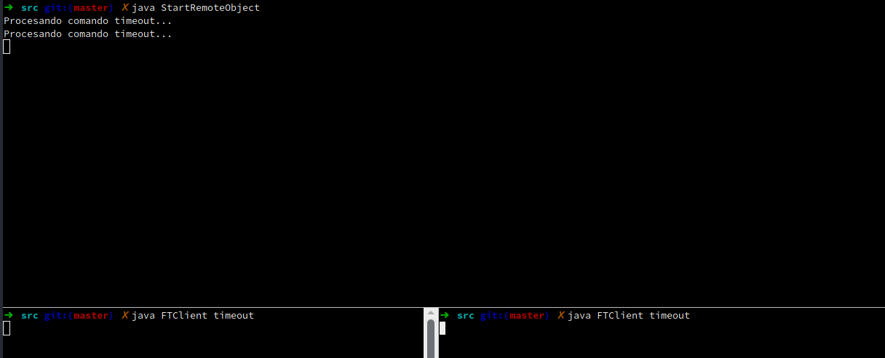

# Practica 2

1. Utilizando como base el programa ejemplo de RMI: 

   a. Analice  si  RMI  es  de  acceso  completamente  transparente  (accesstransparency,  tal  como está definido en Coulouris-Dollimore-Kindberg). Justifique. 
   >
   Dada  la  sintaxis  y  nomenclatura  de  las  operaciones definidas,  no se puede definir a primera vista, si las mismas serán operaciones  locales  o  remotas.   Sin  embargo,  se  debe  realizar un lookup del nombre de las clases en momento de invocación de las mismas teniendo en cuenta el host remoto, ya que no están en el espacio de nombres local.
   Esto nos indica que, si bien a nivel de métodos no tenemos forma a priori de determinar si una operación es local o remota, claro que no hay real diferencia en la invocación de una u otra, si la hay al momento de obtenerla clase remota.
   Ademas ,  se  tiene  en  cuenta  el  manejo  de  errores dados  en  la  comunicación  dado  que  el  método  remoto tiene a fallar con mayor frecuencia que el método local por fallas en la comunicación.
   >
   Por lo tanto, RMI ofrece transparencia de acceso al permitir invocar de la misma forma un procedimiento local y uno remoto. Aunque, la transparencia es parcial dado que se tienen en cuenta otras cuestiones como el  lookup de las clases remotas y errores en la comunicación.   
   >
   b. Enumere los archivos .class que deberían estar del lado del cliente y del lado del servidor y que contiene cada uno. 

   - **AskRemote.class**
   Este archivo presente en el cliente indica a la clase Cliente que realiza el llamado al método remoto. Contiene information de conexión al servidor(hostname), invocación a la clase y método remoto.
   >
   - **StartRemoteObject.class**
   En este archivo dispuesto en el servidor se define la clase encargada de instanciar a la clase contenedora de los métodos remotos a invocar y la registra en el espacio de nombres asegurándose que pueda ser llamada por el cliente.
   >
   - **IfaceRemoteClass.class**
   En este archivo se dispone del lado del servidor y contiene la declaración de la interface en la cual se definen los métodos que el servidor debe implementar para que puedan ser invocados.
   >
   - **RemoteClass.class**
   En este archivo dispuesto del lado del servidor se encuentra la implementación de los métodos definidos en la interface anteriormente mencionada, *IFaceRemoteClass*, para que puedan ser invocadas remotamente. Extiende de *UnicastRemoteObject* que hace que toda la comunicación sea transparente para el programador.
   >
2. Investigue  porque  con  RMI  puede  generarse  el  problema  de  desconocimiento  de  clases  en las JVM e investigue como se resuelve este problema.
   >
   En RMI puede ser que los métodos de un objeto remoto admitan  como  parámetros  a  otras  clases  y  devuelvan clases.  Por lo que un método remoto podría devolver un objeto o admitir un parámetro de una clase desconocida para el cliente.  En ese caso se podría generar una ClassNotFoundException.
   >
   Una  solución  sería  que  tanto  el  servidor como  el cliente  tengan  sus  propias copias  de  las  clases  que  implementen estas interfaces.  Es decir, si ClaseResultado implementa  InterfaceResultado  y  ClaseParametro  implementa   InterfaceParametro,  tanto  el  cliente  como  el servidor  deben  tener  en  su  CLASSPATH los ficherosClaseResultado.class  y  ClaseParametro.class.
   >
   Esto  no seria una solución deseada, ya que se deben saber todas las clases que utiliza el servidor y copiarlas del lado del cliente,  quitando dinamismo y escalabilidad a RMI.  La solución provista por RMI es instalar **RMISecurityManager**,  el  cual  habilita  la  carga  dinámica  de  clases.   De esta  forma  el  servidor  no  necesita  tener  una  copia  de ClaseParametro.class ni el cliente una copia de ClaseResultado.class.
>
3. Implementar con RMI un sistema de archivos remoto implementado:

   a. Defina e implemente con RMI un servidor cuyo funcionamiento permita llevar a cabo las operaciones  desde  un  cliente  enunciadas  informalmente  como  (definiciones  copiadas aquí de la práctica anterior): 
   >
   leer: dado un nombre de archivo, una posición y una cantidad de bytes a leer, retorna 1) la  cantidad  de  bytes  del  archivo  pedida  a  partir  de  la  posición  dada  o  en  caso  de  haber menos bytes, se retornan los bytes que haya y 2) la cantidad de bytes que efectivamente se retornan leidos. 
   >
   escribir:  dado  un  nombre  de  archivo,  una  cantidad  de  bytes  determinada,  y  un  buffer  a partir del cual están los datos, se escriben los datos en el archivo dado. Si el archivo existe, los datos se agregan al final, si el archivo no existe, se crea y se le escriben los datos. En todos los casos se retorna la cantidad de bytes escritos. 
   >
   b. Implemente  un  cliente  RMI  del  servidor  anterior  que  copie  un  archivo  del  sistema  de archivos del servidor en el sistema de archivos local y genere una copia del mismo archivo en el sistema de archivos del servidor. En todos los casos se deben usar las operaciones de lectura y escritura del servidor definidas en el item anterior, sin cambios específicos del servidor para este item en particular. Al finalizar la ejecución del cliente deben quedar tres archivos en total: el original en el lado del servidor, una copia del original en el lado del cliente y una copia en el servidor del archivo original. El comando diff no debe identificar ninguna diferencia entre ningún par de estos tres archivos 
   >
   Utilizamos la estructura de archivos de ejemplo, y definimos una interfaz con 3 metodos, list, read & write.

   Tanto el cliente como el servidor, se alimentan de una interfaz llamada IfaceFTServer donde la clase que los implementa es la clase FTServer.

   Luego, se implementa un cliente que interactuá contra el server, con los comandos básicos. Esto se hizo en la clase FTClient. El servidor utiliza la implementación de la clase FTServer y corre a instancia de un objeto de la clase StartRemoteObject.
   >

4. Investigue    si    es    posible    que    varias    invocaciones    remotas    estén    ejecutándose concurrentemente  y  si  esto  es  apropiado  o  no  para  el  servidor  de  archivos  del  ejercicio anterior.  En  caso  de  que  no  sea  apropiado,  analice  si  es  posible  proveer  una  solución (enunciar/describir   una   solución,   no   es   necesario   implementarla). Nota:   diseñe   un experimento  con  el  que  se  pueda  demostrar  fehacientemente  que  dos  o  más  invocaciones remotas se ejecutan concurrentemente o no. 

Al funciona en Java, RMI permite concurrencia nativa, pero el principal inconveniente en RMI, es que no maneja multihilos de una manera segura, es decir que las invocaciones pueden causar inconsistencia sobre los recursos del servidor. 
Se puede solucionar, utilizando mecanismos para sincronizaron, aunque RMI no provee ninguno por cuenta propia.

En la implementación se cuenta con 2 comandos "seguros" list y read, por otro lado el comando write no lo es.

Los comandos no seguros tiene el inconveniente de la perdida de datos en un servidor.
Para demostrar la concurrencia de de RMI, utilizamos un comando muy simple 'timeout' que realiza un sleep de 3 minutos, para poder ver la ejecución de dos clientes requiriendo del mismo servidor.

1. Tiempos de respuesta de una invocación: 

   a. Diseñe un experimento que muestre el tiempo de respuesta mínimo de una invocación con JAVA RMI. Muestre promedio y desviación estándar de tiempo respuesta.

   Realizamos un .sh que ejecuta una serie de pasos donde colecta 10 comandos times de FTClient, y a través de funciones *Math's de python*  guarda en una carpeta /resultados , en time.dat los 10 datos de times, y crea un csv, guardando el promedio y desviación estándar en tiempo de respuesta.

   Dicho script esta en /script y se ejecuta con ./script/run --build

   La desviación estándar obtenida fue de 14098710, y su promedio (media): 485568.

   Nota: --build es necesario para crear la estructura de los archivos .class para ejecutar rmiregistry y StartRemoteObject para poder instanciar el servidor, para que el FTClient pueda enviarle mensajes.

   b. Investigue los timeouts relacionados con RMI. Como mínimo, verifique si existe un timeout predefinido. Si existe, indique de cuanto es el tiempo y si podría cambiarlo. Si no existe, proponga alguna forma de evitar que el cliente quede esperando indefinidamente. 

   El Paquete **java.rmi** no cuenta con una función timeout configurable, se puede utilizar del paquete **sun.rmi**, el cual cuenta con un método personalizado.
   Ademas se podria utilizar un timer o alguna herramienta similar, pero *java.rmi* no brinda esta funcion.

