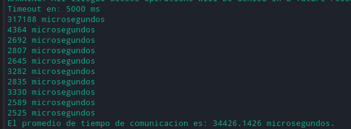
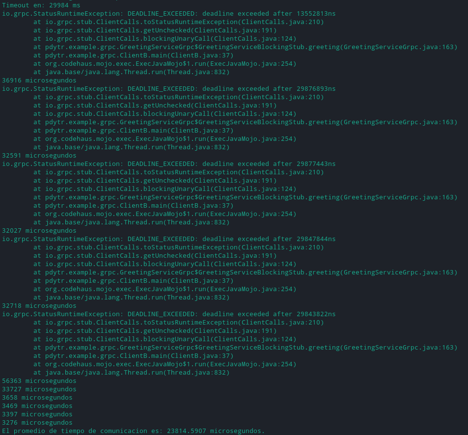

# Práctica 3

1) Utilizando como base el programa ejemplo​1​ de gRPC:

   a)  Mostrar experimentos donde se produzcan errores de conectividad del lado del cliente y del lado del servidor. Si es necesario realice cambios mínimos para,por ejemplo,incluir sleep()o exit(),de forma tal que no se reciban comunicaciones o no haya receptor para las comunicaciones.

   Se modifico el ejemplo dado por la cátedra para generar errores de conectividad del lado del cliente y del servidor.

   Se creo un FailServer.java donde se coloco un exit para cuando la App (FailApp.java) 'adhiera servicio' del servidor (FailServer.java) al intentar hacer una conexion con el cliente falle:
 

   En el lado del cliente se incluyo un sleep (en GreetingServiceImpl.java) para que el proceso se encuentre dormido durante la comunicacion, creando un fallo del lado del cliente.

2) Describir y analizar los tipos de API que tiene gRPC. Desarolle una conclusion acerca de cual es la mejor opcion para los siguientes escenarios:

Existen los siguientes tipos de API en gRPC:

- **Unario**: El cliente envía una **única solicitud al servidor** y obtiene una **única respuesta**, al igual que una llamada de función normal.

   `rpc SayHello(HelloRequest) returns (HelloResponse);`

- **Transmision de servidor**: El cliente **envía una solicitud al servidor** y **obtiene una transmisión para leer una secuencia de mensajes**. El cliente lee el flujo devuelto hasta que no hay más mensajes. gRPC garantiza el orden de los mensajes dentro de una llamada RPC individual.

   `rpc LotsOfReplies(HelloRequest) returns (stream HelloResponse);`

- **Transmision de cliente**: el cliente escribe **una secuencia de mensajes** y los envía al servidor, nuevamente utilizando una transmisión proporcionada. Una vez que el cliente ha terminado de escribir los mensajes, **espera a que el servidor los lea y devuelva su respuesta**. Una vez más, gRPC garantiza el orden de los mensajes dentro de una llamada RPC individual.

   `rpc LotsOfGreetings(stream HelloRequest) returns (HelloResponse);`

- **Transmision bidireccional**: **Ambos lados envían una secuencia de mensajes** mediante una transmisión de lectura y escritura. Los dos flujos **funcionan de forma independiente**, por lo que los clientes y los servidores pueden leer y escribir en el orden que deseen. Se conserva el orden de los mensajes en cada flujo.

   `rpc BidiHello(stream HelloRequest) returns (stream HelloResponse);`

### Casos de uso para los servicos

- Un sistema de pub/sub
   
   [Announcing gRPC Alpha for Google Cloud Pub/Sub](https://cloud.google.com/blog/products/gcp/announcing-grpc-alpha-for-google-cloud-pubsub)

   Pub/Sub es un servicio de mensajería asíncrona que separa los servicios que producen eventos de servicios que procesan eventos.

   Este sistema proporciona un mecanismo de comunicación confiable de muchos a muchos entre publicadores y suscriptores de forma independiente, donde el publicador publica mensajes sobre topicos y cada suscriptor crea una suscripción y consume mensajes de el.

   Para su implementacion se necesitara de dos servicios. El servicio de publicador el cual debe encargarse de crear topicos y publicar mensajes en esos topicos.
   Tambien debe contar con un servicio de suscriptor que debe encargarse de crear nuevas suscripciones para un topico y de obtener los mensajes para cada topico.

   Estas dos acciones trabajan de manera totalmente independiente por lo que pueden aplicarse con el tipo **Unario** de gRPC.

- Un sistema de archivos FTP
   
   Para realizar FTP (File Transfer Protocol), una de las API's necesarias es la de okhttp, ya que es un protocolo de red y los sistemas están conectados a una red TCP. Ademas el io.grpc que tiene el core donde tiene funciones para el manejo de archivos como FileOutputStream, FileInputStream, BufferedInputStream,BufferedOutputStream, File, entre otros para poder realizar una transferencia de archivos entre sistemas, basado en la arquitectura cliente-servidor.

   Para su implementacion, se tiene minimamente un servicio de dos llamados rpc, uno es subida de archivos al servidor del tipo **transmision de cliente** ya que el cliente debe enviar los bytes en multiples mensajes, esperar que el servidor los lea y retorne su respuesta.

   El restante se utiliza para la descarga de archivos de tipo **transmision de servidor** en el cual el cliente envía una solicitud al servidor requiriendo la lectura del archivo, luego obtiene una transmisión para leer una secuencia de mensajes que contienen los bytes del archivo.
   
- Un sistema de chat
        
   Netty seria la mejor solución para generar un chat ya que tiene canales y funciones como eventLoopGroup que nos permite dejar un canal abierto donde se pueden conectar dos clientes e interactuar entre si.

   Para la implementacion de un sistema de chat, se debe tener un servicio de tipo **transmision bidireccional** ya que se necesita que tanto cliente como servidor operen de forma independiente(clientes y servidores pueden leer y escribir en cualquier orden)

   En el lado del servidor, necesitaremos escuchar los mensajes transmitidos entrantes y derivarlos a los usuarios correspondientes.

Paquetes java mas importantes de la api gRPC.

- **io.grpc**: es el core publico de grpc
  - BindableService: Proporciona una forma de vincular una instancia de implementación de servicio al servidor.
  -  ClientInterceptor: Interfaz para interceptar llamadas salientes antes de que sean enviadas por un *channel*.
  - Codec: Compresión y descompresión de mensajes.
  - Compressor: Representa un compresor de mensajes.
  - Context.CancelattionListener: observer de cancelación de contexto.
  - Decompressor: Representa un descrompresor de mensajes.
  - Drainable: Extensión a InputStream o similar agregando un método que transfiera todo el contenido a OutputStream.
  - ServerInteceptor: Interfaz para interceptar las llamadas entrantes antes de que ServerCallHandler las envíe.
  - Entre otras.
- **io.grpc.auth**: Implementaciones de CallCredentials y API relacionadas con la autenticación.
- **io.grpc.grpclb**
- **io.grpc.inprocess**: transporte 'in-process' cuando el servidor y cliente se encuentra en el mismo proceso.
- **io.grpc.netty**: implementacion de [Netty](https://netty.io/) 
  
  - *Netty is a NIO client server framework which enables quick and easy  development of network applications such as protocol servers and  clients. It greatly simplifies and streamlines network programming such  as TCP and UDP socket server.*
- **io.grpc.okhttp**: un transporte ligero basado en  [OkHttp](http://square.github.io/okhttp/), utilizado principalmente en  Android (client-only).
  
  - *OkHttp perseveres when the network is troublesome: it will silently recover from common connection problems. If your service has multiple IP addresses OkHttp will attempt alternate addresses if the first connect fails. This is necessary for IPv4+IPv6 and services hosted in redundant data centers. OkHttp supports modern TLS features (TLS 1.3, ALPN, certificate pinning). It can be configured to fall back for broad connectivity*
- **io.grpc.protobuf** : API para gRPC sobre protocolos de buffers, incluidas herramientas para serializar y deserializar mensajes protobuf.
- **io.grpc.protobuf.lite**: API para gRPC sobre protocolos de buffers, con clases de mensajes proto generadas por la biblioteca Lite Runtime.
- **io.grpc.protobuf.services**
- **io.grpc.services**:   Servicios y utilidades para los servicios de gRPC predefinidos.
- **io.grpc.stub**: API para la capa Stub.
- **io.grpc.testing**: Api de testing.
- **io.grpc.util**: utilidades de la capa core.

3) Analizar la transparencia de gRPC en cuanto al manejo de parametros de los procedimientos remotos. Considerar lo que sucede en el caso de los valores de retorno. Puede aprovechar el ejemplo provistos.

   En el ejemplo podemos ver el valor de retorno de objetos Observers, utilizados tanto por los stubs del cliente como las implementaciones de servicios para enviar o recibir 'stream messages'.

   Para los mensajes salientes, la biblioteca GRPC proporciona un StreamObserver a la aplicación. Para los mensajes entrantes, la aplicación implementa StreamObserver y lo pasa a la biblioteca GRPC para su recepción.

   Con metodos como el  onCompleted(): Recibe una notificación de finalización exitosa de la transmisión. onError(Throwable t) y onNext(V value): Recibe un valor de la secuencia.

   Lo que hace que GRPC utilice una capa de abstaccion en su manejo en lo valores de retorno.

4) Con la finalidad de contar con una version muy restringida de un sistema de archivos remotos, en el cual se puede llevar a cabo las operaciones enunciadas informalmente como:

   - Leer
   - Escribir

a.- Defina e implemente con gRPC un servidor. Documente todas las decisiones tomadas.

Archivos utilizados:
Para este punto se implementaron funciones basicas para el manejo de archivos(lectura y escritura).

- **FileService.proto**: Se definen las estructuras de los mensajes y servicios del protocolo. Los mensajes son utilizados para definir la composicion de una peticion o respuesta, las cuales seran utilizados por un servicio.

- **FileServiceImpl.java**: Implementa los servicios declarados en `FileService.proto`, en concreto las funciones onNext, onCompleted, onError del protocolo gRPC. Toma los valores de las peticiones para llevar a cabo las operaciones correspondientes.

- **UploadFileServer.java**: El proposito de esta clase Java es hacer de servidor, crea un socket de que se queda escuchando indefinidamente en un puerto establecido esperando nuevas peticiones.

- **UploadFileClient.java**: La clase cliente es la encargada de crear y enviar peticiones al servicio de gRPC. Por cada peticion los datos se dividen en buffers de 512kb, con el fin de evitar problemas con archivos de gran tamaño ademas de reducir la cantidad máxima de memoria requerida para procesar cada mensaje.

b.- Investigue si es posible que varias invocaciones remotas esten ejecutandose concurrentemente y si esto es apropiado o no para el servidor de archivos del ejercicio anterior. En caso de que no se apropiado, analice si es posible proveer una solucion (enunciar/describir una solucion, no es necesario implementarla).
**Nota:** diseñe un experimento con el que se pueda demostrar fehacientemente que dos o mas invocaciones remotas se ejecutan concurrentemente o no.

Al funcionar en Java, gRPC permite concurrencia nativa, pero el principal inconveniente en gRPC, es que no maneja multihilos de una manera segura por defecto, es decir que las invocaciones pueden causar inconsistencia sobre los recursos del servidor. Se puede solucionar, utilizando mecanismos para sincronizarlo, lo cual gRPC lo provee.

En la implementación cuenta con read un comando seguro, por lo que si al leer el mismo archivo concurrentemente no hay problemas de colision, por otro lado el comando write no lo es.

Se realizo un experimento donde el Cliente A y el Cliente B hacen peticiones concurrentemente sobre el servidor.

Nota: para correr el experimento primero levantar el *App.java* y luego correr el script *runClient.sh*

5) Timeouts en gRPC:
   a.- Desarrollar un experimento que muestre el timeout definido para las llamadas gRPC y el promedio de tiempo de una llamada gRPC.

   >gRPC allows clients to specify how long they are willing to wait for an RPC to complete before the RPC is terminated with a DEADLINE_EXCEEDED error. On the server side, the server can query to see if a particular RPC has timed out, or how much time is left to complete the RPC.
   >Specifying a deadline or timeout is language specific: some language APIs work in terms of timeouts (durations of time), and some language APIs work in terms of a deadline (a fixed point in time) and may or maynot have a default deadline.

   [Deadlines](https://grpc.io/blog/deadlines/)

Se desarrollo un experimento con la funcion withDeadlineAfter y se generaron 10 iteraciones del cliente/servidor para llegar a un promedio aproximado de 34426 ms

   b.- Reducir el timeout de las llamadas gRPC a un 10% menos del promedio encontrado anteriormente. Mostrar y explicar el resultado para 10 llamadas.

Al reducir un 10% el promedio encontrado anterior mente quedo el timeout en 29984 ms, en donde las consultas que sobrepasan ese tiempo, daba error de 'deadline exceeded after'.

   

c.- Desarrollar un cliente/servidor gRPC de forma tal que siempre se supere el tiempo de timeout. Una forma sencilla puede utilizar el tiempo de timeout como parametro del procedimiento remoto donde se lo utiliza del lado del servidor en una llamda a sleep(), por ejemplo.

Se genero un sleep en un while true hasta que el contexto de la comunicacion no se cancele por 'timeout'.

